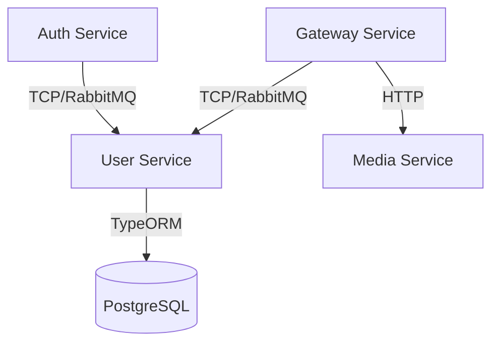
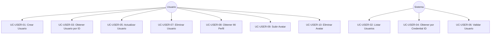
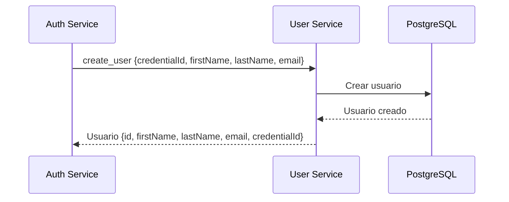
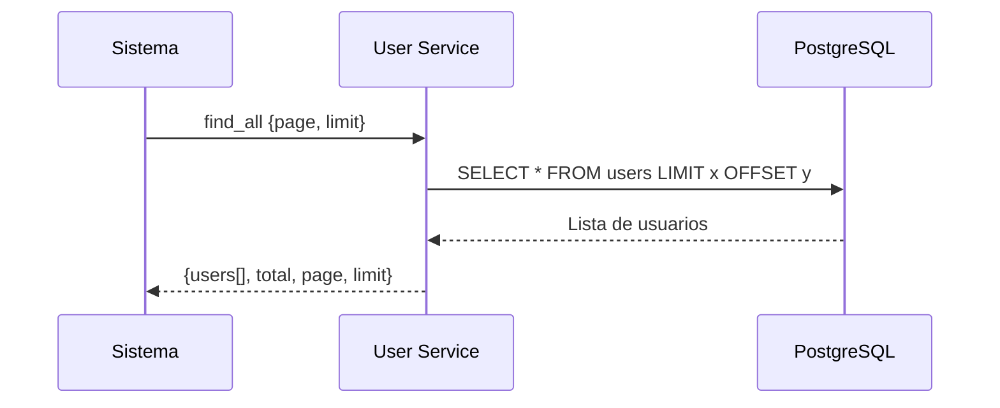
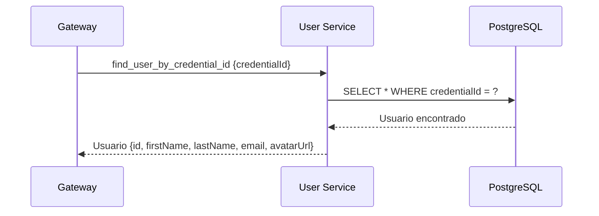
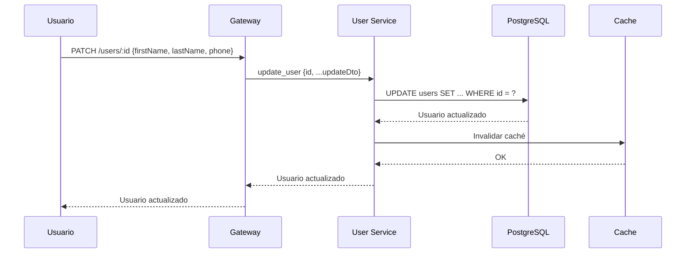
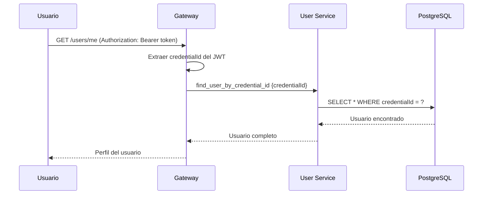
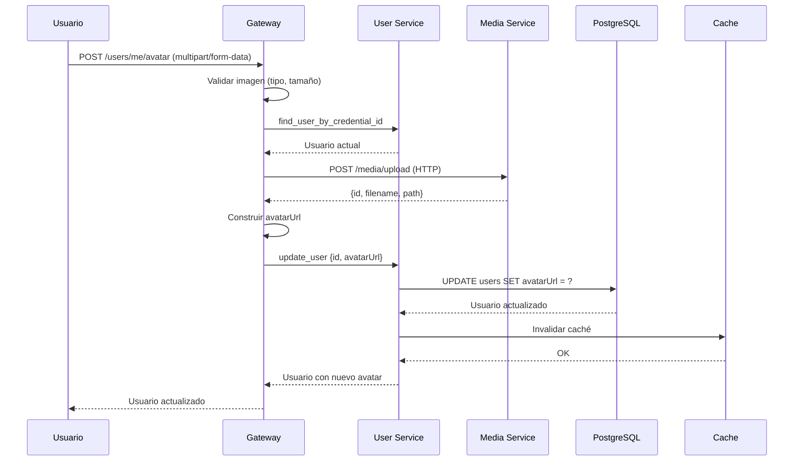
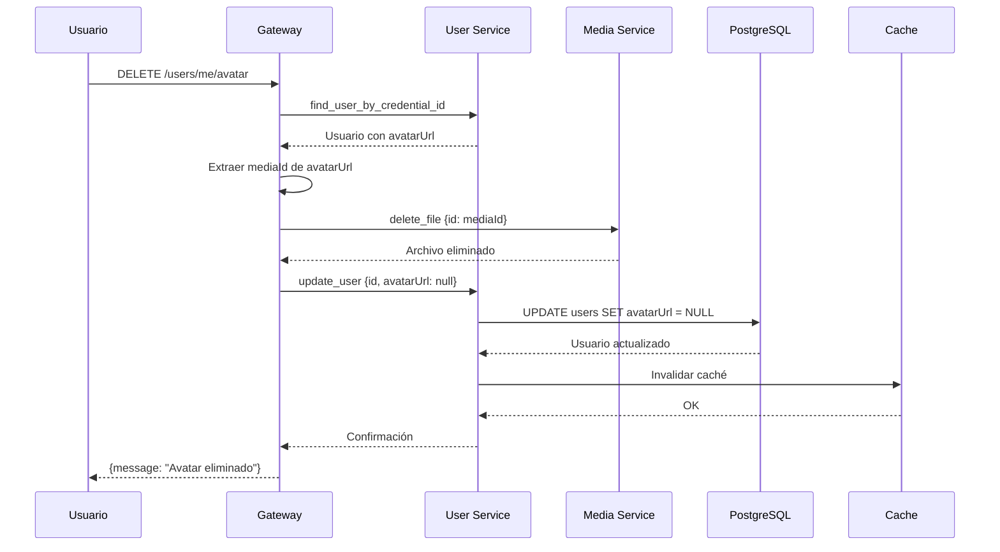

# User Service

## Descripción

Servicio de gestión de usuarios para la aplicación "Libreta Sanitaria de Mascotas". Maneja el perfil de usuarios, información personal, y gestión de avatares.

## Tecnologías

- **Framework**: NestJS
- **Base de Datos**: PostgreSQL (con TypeORM)
- **Mensajería**: RabbitMQ
- **Validación**: class-validator

## Arquitectura



## Casos de Uso

### Diagrama General de Casos de Uso



---

### UC-USER-01: Crear Usuario

**Descripción**: Crea un nuevo usuario en el sistema (generalmente llamado desde Auth Service).

**Actor**: Sistema (Auth Service)

**Precondiciones**: 
- Credencial debe existir en Auth Service
- Email debe ser único

**Flujo Principal**:
1. Auth Service envía datos del usuario (credentialId, firstName, lastName, email)
2. Sistema valida datos
3. Sistema crea usuario en la base de datos
4. Sistema retorna usuario creado

**Postcondiciones**:
- Usuario creado y asociado a credencial

**Diagrama de Secuencia**:



---

### UC-USER-02: Listar Todos los Usuarios

**Descripción**: Obtiene lista paginada de usuarios (uso administrativo).

**Actor**: Sistema/Administrador

**Precondiciones**: 
- Ninguna

**Flujo Principal**:
1. Sistema solicita lista de usuarios con parámetros de paginación
2. Sistema consulta base de datos
3. Sistema retorna lista paginada

**Postcondiciones**:
- Lista de usuarios retornada

**Diagrama de Secuencia**:



---

### UC-USER-03: Obtener Usuario por ID

**Descripción**: Obtiene información de un usuario específico por su ID.

**Actor**: Sistema

**Precondiciones**: 
- Usuario debe existir

**Flujo Principal**:
1. Sistema solicita usuario por ID
2. Sistema busca en base de datos
3. Sistema retorna datos del usuario

**Postcondiciones**:
- Datos del usuario retornados

---

### UC-USER-04: Obtener Usuario por Credential ID

**Descripción**: Obtiene usuario asociado a una credencial específica.

**Actor**: Sistema (Gateway, Auth Service)

**Precondiciones**: 
- Credencial debe existir

**Flujo Principal**:
1. Sistema solicita usuario por credentialId
2. Sistema busca en base de datos
3. Sistema retorna datos del usuario

**Postcondiciones**:
- Datos del usuario retornados

**Diagrama de Secuencia**:



---

### UC-USER-05: Actualizar Usuario

**Descripción**: Actualiza información del perfil de usuario.

**Actor**: Usuario

**Precondiciones**: 
- Usuario debe existir
- Usuario debe estar autenticado

**Flujo Principal**:
1. Usuario envía datos a actualizar (firstName, lastName, phone, avatarUrl, etc.)
2. Sistema valida datos
3. Sistema actualiza usuario en base de datos
4. Sistema invalida caché del usuario
5. Sistema retorna usuario actualizado

**Postcondiciones**:
- Usuario actualizado
- Caché invalidado

**Diagrama de Secuencia**:



---

### UC-USER-06: Validar Usuario

**Descripción**: Verifica si un usuario existe (usado internamente por otros servicios).

**Actor**: Sistema

**Precondiciones**: 
- Ninguna

**Flujo Principal**:
1. Sistema solicita validación de usuario por ID
2. Sistema verifica existencia en base de datos
3. Sistema retorna resultado de validación

**Postcondiciones**:
- Resultado de validación retornado

---

### UC-USER-07: Eliminar Usuario

**Descripción**: Elimina un usuario del sistema.

**Actor**: Usuario/Administrador

**Precondiciones**: 
- Usuario debe existir

**Flujo Principal**:
1. Sistema solicita eliminación de usuario
2. Sistema elimina usuario de base de datos
3. Sistema retorna confirmación

**Postcondiciones**:
- Usuario eliminado

---

### UC-USER-08: Obtener Mi Perfil (Me)

**Descripción**: Obtiene el perfil del usuario autenticado actualmente.

**Actor**: Usuario

**Precondiciones**: 
- Usuario debe estar autenticado

**Flujo Principal**:
1. Usuario solicita su perfil
2. Gateway extrae credentialId del token JWT
3. Sistema busca usuario por credentialId
4. Sistema retorna datos del perfil

**Postcondiciones**:
- Perfil del usuario retornado

**Diagrama de Secuencia**:



---

### UC-USER-09: Subir Avatar de Usuario

**Descripción**: Permite al usuario subir una imagen de avatar.

**Actor**: Usuario

**Precondiciones**: 
- Usuario debe estar autenticado
- Archivo debe ser una imagen válida (JPEG, PNG, WebP)
- Tamaño máximo: 5MB

**Flujo Principal**:
1. Usuario selecciona imagen de avatar
2. Gateway valida formato y tamaño
3. Gateway sube imagen al Media Service (HTTP)
4. Media Service almacena imagen y retorna ID
5. Gateway actualiza usuario con nueva avatarUrl
6. Gateway invalida caché del usuario
7. Sistema retorna usuario con nuevo avatar

**Postcondiciones**:
- Avatar subido al Media Service
- Usuario actualizado con avatarUrl
- Caché invalidado

**Diagrama de Secuencia**:



---

### UC-USER-10: Eliminar Avatar de Usuario

**Descripción**: Elimina el avatar del usuario y restaura el avatar por defecto.

**Actor**: Usuario

**Precondiciones**: 
- Usuario debe estar autenticado
- Usuario debe tener avatar configurado

**Flujo Principal**:
1. Usuario solicita eliminar avatar
2. Gateway obtiene usuario actual
3. Gateway extrae mediaId de avatarUrl
4. Gateway elimina archivo del Media Service
5. Gateway actualiza usuario con avatarUrl = null
6. Gateway invalida caché del usuario
7. Sistema retorna confirmación

**Postcondiciones**:
- Avatar eliminado del Media Service
- Usuario actualizado con avatarUrl null
- Caché invalidado

**Diagrama de Secuencia**:



---

## Entidades Principales

### User Entity

```typescript
{
  id: string (UUID)
  credentialId: string (unique, FK a Auth Service)
  firstName: string
  lastName: string
  email: string (unique)
  phone?: string
  avatarUrl?: string
  createdAt: Date
  updatedAt: Date
}
```

## Message Patterns (RabbitMQ)

| Comando | Descripción |
|---------|-------------|
| `create_user` | Crear nuevo usuario |
| `find_all` | Listar usuarios (paginado) |
| `find_user` | Obtener usuario por ID |
| `find_user_by_credential_id` | Obtener usuario por credentialId |
| `update_user` | Actualizar usuario |
| `validate_user` | Validar existencia de usuario |
| `delete_user` | Eliminar usuario |

## API Endpoints (Gateway)

| Método | Endpoint | Descripción | Autenticación |
|--------|----------|-------------|---------------|
| GET | `/users/me` | Obtener perfil del usuario autenticado | ✅ JWT |
| PATCH | `/users/:id` | Actualizar usuario | ✅ JWT |
| POST | `/users/me/avatar` | Subir avatar | ✅ JWT |
| DELETE | `/users/me/avatar` | Eliminar avatar | ✅ JWT |

## Variables de Entorno

```env
# Database
DATABASE_HOST=localhost
DATABASE_PORT=5432
DATABASE_USER=postgres
DATABASE_PASSWORD=postgres
DATABASE_NAME=user_db

# RabbitMQ
RABBITMQ_URL=amqp://localhost:5672
```

## Instalación y Ejecución

```bash
# Instalar dependencias
npm install

# Ejecutar migraciones
npm run migration:run

# Modo desarrollo
npm run start:dev

# Modo producción
npm run build
npm run start:prod
```

## Puerto

- **3002** (TCP para RabbitMQ)
